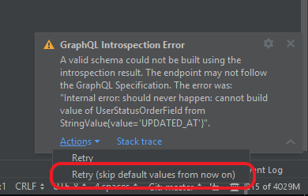

# GraphQL Config Example: GitHub API V4

This example demonstrates how to authenticate against the GitHub API by defining a bearer token as an environment variable
in the `.graphqlconfig` file.

Note: The GitHub endpoint is not fully GraphQL spec compliant in how it serializes default values.
When introspecting you'll see a warning that a valid schema could not be built. The work-around is
to skip the default values using the notification action `Retry (skip default values from now on`:
  

The next introspection queries performed in the project will skip default values.

You can use the "Languages & Frameworks > GraphQL" settings page to edit this later on a per-project basis. 

__Notes and comments__
- If you're authoring a schema using GraphQL SDL, you should modularize it into multiple files to ensure a performant editing experience
  as the schema grows.