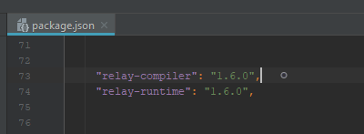
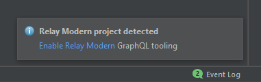
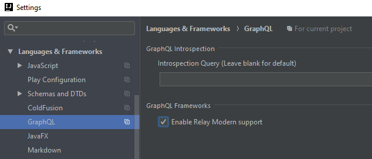

# GraphQL Config Example: Relay (Modern)

This example demonstrates how to setup a Relay Project -- https://facebook.github.io/relay/.

At project startup the plugin looks for Relay Modern dependencies in `package.json`

You should then see the following notification

This enables Relay framework support which can also be toggled in the settings panel:

Enabling Relay adjusts the behavior of error highlighting since Relay "polyfills" GraphQL
with directives that have dynamic arguments. The Relay directives are automatically
included in schema discovery when the setting is enabled.  

__Notes and comments__
- Relay component files (js, jsx, ts, tsx) must be explicitly allowed by the "includes" glob if one is specified to be associated with their schema.
  Note that you can use `*` and `**` in the globs since only file types supported by the plugin will be processed.  
- For the official Relay example see https://github.com/relayjs/relay-examples